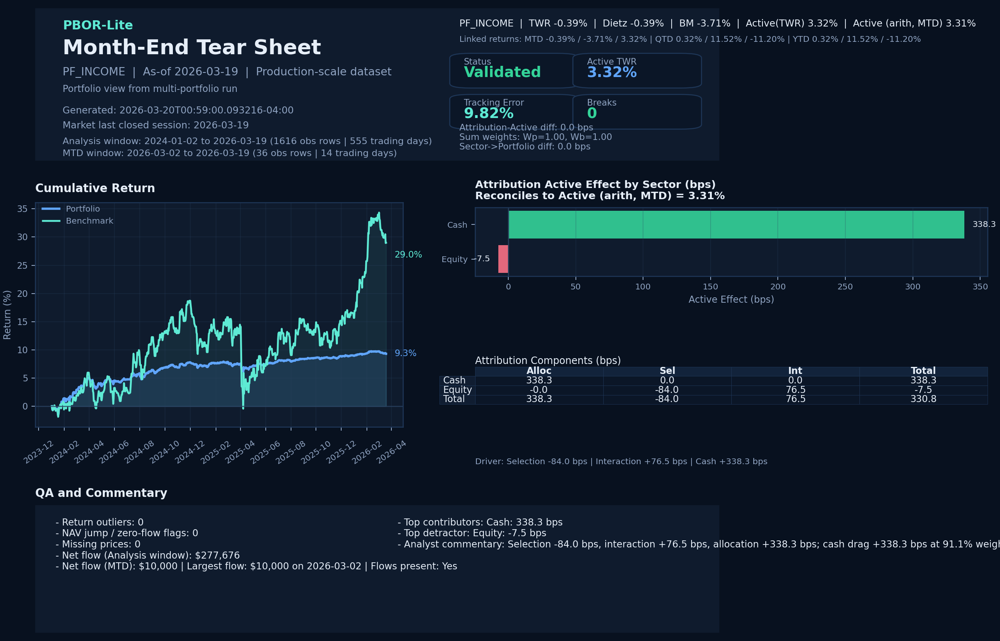

# PBOR-Lite

Performance book of record for return measurement, attribution, QA controls, and reporting.

## What It Does

- Builds PBOR input files from live market data.
- Runs monthly return, attribution, reconciliation, and QA workflows.
- Publishes a SQLite-backed dashboard plus a monthly output pack.

## Architecture

```text
yfinance + FRED
       |
       v
scripts/build_real_data.py
       |
       v
src/run_month_end.py
       |
       +--> pbor_lite.db
       |
       +--> outputs/YYYY-MM/
       |
       v
app/dashboard.py
```

## Quick Start

```powershell
python -m pip install -r requirements.txt
python scripts/build_real_data.py
python -m src.run_month_end --asof $(python scripts/last_month_end.py) --data-dir .\data_real\market_real
streamlit run app/dashboard.py
```

## Sample Output



## Output Pack

Each run writes to `outputs/YYYY-MM/`.

- `report.xlsx`: workbook with returns, attribution, reconciliation, and breaks
- `onepager.pdf`: monthly tear sheet
- `tearsheet.png`: image export
- `controls_table.png`: controls snapshot
- `onepager.md`: written summary
- `summary.json`: run metadata
- `attribution_reconciliation.csv`: reconciliation output

## Methodology

Methodology notes are in [METHODOLOGY.md](METHODOLOGY.md).

## Project Structure

```text
PBOR-Lite/
|-- app/
|   `-- dashboard.py
|-- data/
|-- data_real/
|   |-- market_real/
|   `-- market_real_multi/
|-- docs/
|   `-- tearsheet-sample.png
|-- outputs/
|-- scripts/
|   |-- build_real_data.py
|   `-- last_month_end.py
|-- sql/
|-- src/
|   |-- attribution.py
|   |-- export.py
|   |-- ingest.py
|   |-- qa.py
|   |-- reconciliation.py
|   |-- report.py
|   |-- returns.py
|   `-- run_month_end.py
|-- tests/
|-- .github/
|   `-- workflows/
|       `-- monthly_run.yml
|-- METHODOLOGY.md
|-- pbor_lite.db
|-- policy.yaml
`-- requirements.txt
```

## Tech Stack

Python, pandas, NumPy, yfinance, FRED, requests, PyYAML, Streamlit, SQLite, matplotlib, and openpyxl.
