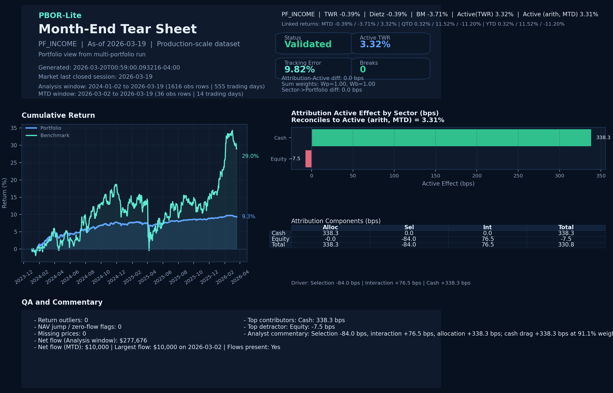

# Portfolio Reconciliation & Reporting Control Engine

A Python-based PBOR-style portfolio reconciliation, attribution, QA controls, and month-end reporting workflow built to simulate how investment operations and portfolio analytics teams validate data before reporting sign-off.

The workflow rebuilds positions from transactions, calculates TWR and Modified Dietz returns, performs Brinson-Fachler attribution, runs QA and reconciliation controls, and exports review-ready reporting packs in Excel, CSV, PDF, PNG, SQLite, and Streamlit.

The GitHub repository slug remains `PBOR`; Portfolio Reconciliation & Reporting Control Engine is the recruiter-facing project name used in the documentation and dashboard.

## Overview

This is a public educational/demo project for portfolio analytics, investment operations, investment reporting, and middle-office control workflows. It uses bundled sample inputs, optional public market data, and synthetic operational records to demonstrate a PBOR-style simulation without using real client, custodian, bank, or trade data.

The project is intentionally compact: the goal is to show the end-to-end control logic clearly, not to claim production-grade accounting infrastructure.

## Business Workflow

- Load transactions, holdings, prices, FX, benchmark weights, and benchmark returns.
- Rebuild daily positions from transactions, prices, and FX.
- Calculate daily returns, monthly TWR, and Modified Dietz returns.
- Perform Brinson-Fachler sector attribution.
- Reconcile attribution to active return and flag failed controls.
- Run QA checks for missing data, outliers, holdings mismatches, and NAV jumps.
- Run PBOR-vs-custodian and ledger-vs-bank reconciliation using synthetic operational records.
- Generate an exception queue for review.
- Track exception lifecycle status and SLA aging buckets.
- Generate a sign-off summary across attribution, QA, position reconciliation, and cash reconciliation controls.
- Determine whether the month-end reporting pack is ready for review/sign-off.
- Export a reporting and sign-off pack for month-end review.

## Auto-Reconciliation Workflow

The auto-reconciliation workflow uses synthetic operational records because real PBOR, custodian, bank, and broker files are confidential. The demo compares internal PBOR-style records against custodian/bank-style records and applies configurable tolerance rules.

It classifies:

- Quantity breaks
- Price breaks
- Market value breaks
- Securities missing from the custodian file
- Securities missing from the internal PBOR-style file
- Cash breaks between internal ledger and bank-style records

Each record receives a status, severity, root-cause explanation, resolution note, owner, and age bucket so the output looks like a realistic middle-office exception queue.

## Exception Lifecycle & Sign-Off Control Center

The reconciliation output separates technical match status from operational workflow status.

- Technical status identifies the result type, such as `MATCHED`, `QUANTITY_BREAK`, `PRICE_BREAK`, `CASH_BREAK`, or missing-record breaks.
- Workflow status tracks whether a record is `OPEN` or `CLOSED`.
- SLA buckets classify open breaks as `CURRENT`, `WATCHLIST`, or `BREACHED`.
- The `action_required` field gives the review step an operations analyst would take next.
- The sign-off summary aggregates Attribution Reconciliation, QA Controls, PBOR vs Custodian Positions, and Cash Reconciliation.
- Final reporting sign-off remains `Not Ready` until failed controls are resolved.

## Sample Output



Sample tear sheet generated from the repo's bundled sample dataset. It is included to show the reporting format of this personal project, not live client reporting.

## Tech Stack

Python, pandas, NumPy, SQLite, Streamlit, matplotlib, openpyxl, PyYAML, requests, `yfinance`, FRED, `exchange_calendars`, and `pandas_market_calendars`.

## Quick Start

Run the bundled synthetic portfolio reporting workflow:

```bash
python -m pip install -r requirements.txt
python -m src.run_month_end --asof 2026-01-10
streamlit run app/dashboard.py
```

Run the PBOR-vs-custodian reconciliation demo:

```bash
python scripts/build_recon_demo_data.py
python -m src.run_month_end --asof 2026-01-10 --recon-data-dir data/recon_demo
streamlit run app/dashboard.py
```

Optional: build a public-market-data input set, then run month-end against it:

```bash
python scripts/build_real_data.py --out-dir ./data_real/market_real
python scripts/last_month_end.py
python -m src.run_month_end --asof YYYY-MM-DD --data-dir ./data_real/market_real
```

## Verify The Demo

```bash
python scripts/run_full_demo.py
python scripts/verify_demo_outputs.py
pytest -q
streamlit run app/dashboard.py
```

The verification flow uses bundled synthetic data only. It does not require `build_real_data.py`, and it does not rely on external market-data calls.

## Project Outputs

Each month-end run writes a dated output folder under `outputs/YYYY-MM/` plus an updated SQLite database at `pbor_lite.db`. These artifacts are generated locally; they are not the source of truth in Git.

- `report.xlsx`: Excel workbook with performance, attribution, QA, and reconciliation sheets
- `AutoReconExceptions`: Excel sheet containing PBOR-vs-custodian and cash reconciliation output
- `SignOffSummary`: Excel sheet containing control-area pass/fail and reporting readiness
- `recon_exceptions.csv`: auto-reconciliation exception queue
- `signoff_summary.csv`: sign-off control summary by control area
- `daily_returns.csv`: daily performance time series
- `monthly_returns.csv`: monthly TWR, Modified Dietz, benchmark, and active return output
- `attribution.csv`: Brinson-Fachler attribution output
- `attribution_reconciliation.csv`: attribution-to-active-return control output
- `breaks.csv`: QA and control breaks
- `qa_ingest_summary.csv`: ingest validation summary
- `onepager.pdf`: one-page summary tear sheet for quick review
- `tearsheet.png`: image export of the tear sheet
- `controls_table.png`: QA and control snapshot
- `summary.json`: run metadata, controls, file manifest, and sign-off metrics

## Methodology

- [METHODOLOGY.md](METHODOLOGY.md): detailed notes on return methodology, attribution, PBOR-vs-custodian reconciliation, and controls
- [docs/Methodology.md](docs/Methodology.md): concise formula reference
- [docs/HowItWorks.md](docs/HowItWorks.md): workflow walkthrough
- [docs/DemoScenario.md](docs/DemoScenario.md): synthetic break scenario used in the reconciliation demo

## Project Verification

- `pytest -q` covers returns, attribution, auto-reconciliation, and sign-off logic.
- `python scripts/verify_demo_outputs.py` validates the generated output pack, workbook sheets, summary JSON keys, and SQLite tables.
- GitHub Actions runs the synthetic demo verification flow on push and pull request.
- Synthetic data only; no confidential client, custodian, bank, or trade data.

## Interview Talking Point

I built a Python-based portfolio reconciliation and reporting control engine that rebuilds positions from transactions, calculates performance and attribution, compares PBOR-style records against custodian and bank-style records, classifies breaks, tracks exception lifecycle and SLA aging, and generates a sign-off summary to determine whether the month-end reporting pack is ready for review.

## Limitations

- Uses synthetic operational records for public demo purposes.
- Does not include real client data, real custodian files, real bank records, or real trade files.
- Public educational demo, not a production accounting system.
- Not a production-grade investment book of record, reconciliation platform, or reporting infrastructure.
- Controls, benchmark construction, and portfolio coverage are intentionally simplified to keep the project transparent and runnable from a public repo.
- `data/recon_demo/*.csv`, `outputs/`, and `pbor_lite.db` are generated locally from scripts rather than treated as committed source artifacts.

## Testing

```bash
pytest -q
```

## Repository Structure

- `src/`: month-end pipeline modules for returns, attribution, reconciliation, auto-recon, QA, export, and reporting
- `pbor/`: date-context and market-calendar helpers
- `app/`: Streamlit dashboard over the SQLite output
- `data/`: bundled synthetic input files and optional synthetic reconciliation demo files
- `docs/`: methodology notes and sample tear sheet image
- `scripts/`: data builders and helper utilities
- `sql/`: SQLite DDL and reporting views
- `tests/`: pytest coverage for return logic, attribution, reporting, calendar behavior, and auto-reconciliation
